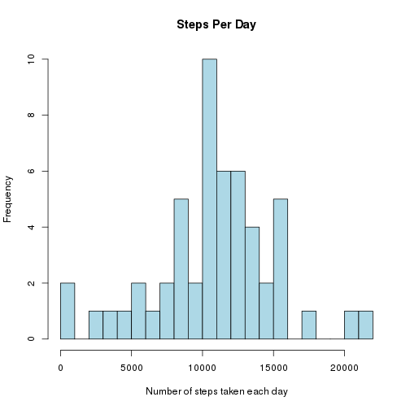
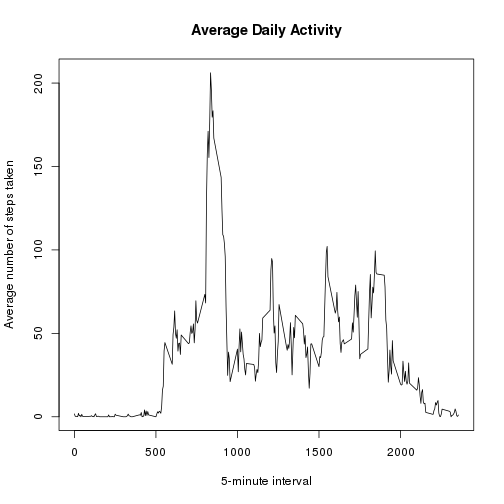
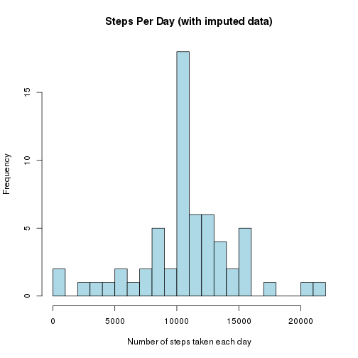

# Activity Analysis

This assignment makes use of data from a personal activity monitoring device. This device collects data at 5 minute intervals through out the day. The data consists of two months of data from an anonymous individual collected during the months of October and November, 2012 and include the number of steps taken in 5 minute intervals each day.

## Loading and preprocessing the data

```r
activity_data <- read.csv("activity.csv", header=TRUE)
```


## What is mean total number of steps taken per day?

```r
library(reshape2)
melted_activity_data <- melt(activity_data, id=c("date"),
                             measure.vars=("steps"), na.rm=TRUE)
sum_melted_data <- dcast(melted_activity_data, date~variable, sum)
hist(sum_melted_data$steps, breaks=25, main="Steps Per Day",
     xlab="Number of steps taken each day", col="lightblue")
```

 

```r
steps_per_day_mean <- format(mean(sum_melted_data$steps), digits=8)
steps_per_day_median <- median(sum_melted_data$steps)
```
Mean of the total number of steps taken per day: 10766.189

Median of the total number of steps taken per day: 10765


## What is the average daily activity pattern?

```r
melted_activity_data <- melt(activity_data, id=c("interval"),
                             measure.vars=("steps"), na.rm=TRUE)
mean_melted_data <- dcast(melted_activity_data, interval~variable, mean)
plot(mean_melted_data$interval, mean_melted_data$steps, type="l",
     main="Average Daily Activity", xlab="5-minute interval",
     ylab="Average number of steps taken")
```

 

Which 5-minute interval, on average across all the days in the dataset, contains the maximum number of steps?

```r
mean_melted_data[which.max(mean_melted_data$steps),]
```

```
##     interval    steps
## 104      835 206.1698
```


## Imputing missing values
Calculate and report the total number of missing values in the dataset


```r
length(which(is.na(activity_data$steps)))
```

```
## [1] 2304
```

Create a new dataset that is equal to the original dataset but with the missing data filled in

I have chosen to use the previously-created mean_melted_data to fill in empty values. Each empty value will be filled in with the average value for that interval.


```r
activity_data_impuned <- activity_data
for (i in which(is.na(activity_data_impuned$steps)))
  activity_data_impuned[i, 1] <-
    mean_melted_data[which(mean_melted_data[,1]==activity_data_impuned[i,3]),2]
```


```r
melted_activity_data_impuned <- melt(activity_data_impuned, id=c("date"),
                             measure.vars=("steps"))
sum_melted_data_impuned <- dcast(melted_activity_data_impuned, date~variable, sum)
hist(sum_melted_data_impuned$steps, breaks=25, main="Steps Per Day (with impuned data)",
     xlab="Number of steps taken each day", col="lightblue")
```

 

```r
steps_per_day_mean_impuned <- format(mean(sum_melted_data_impuned$steps), digits=8)
steps_per_day_median_impuned <- format(median(sum_melted_data_impuned$steps), digits=8)
```

Mean of the total number of steps taken per day: 10766.189

Median of the total number of steps taken per day: 10766.189

By adding impuned data, the mean number of steps per day remained the same, while the median became equal to the mean.


## Are there differences in activity patterns between weekdays and weekends?

Create a new factor variable in the dataset with two levels – “weekday” and “weekend” indicating whether a given date is a weekday or weekend day.


```r
activity_data_impuned$day <- ifelse(grepl("Sat|Sun", weekdays(as.Date(activity_data_impuned$date), abbreviate=TRUE)), "weekend", "weekday")
```


```r
melted_activity_data_day <- melt(activity_data_impuned, id=c("interval", "day"), measure.vars=("steps"))
mean_melted_data_day <- dcast(melted_activity_data_day, interval~day, mean)
plot.par <- par(mfrow=c(2,1))
plot(mean_melted_data_day$interval, mean_melted_data_day$weekday, type="l", main="Average Weekday Activity", xlab="", ylab="Average number of steps taken")
plot(mean_melted_data_day$interval, mean_melted_data_day$weekend, type="l", main="Average Weekend Activity", xlab="5-minute interval", ylab="Average number of steps taken")
```

 
